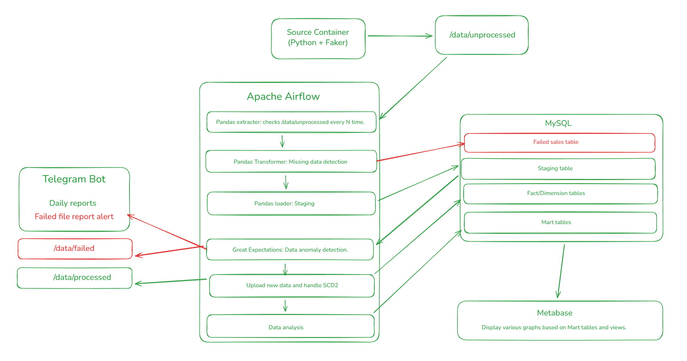
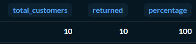
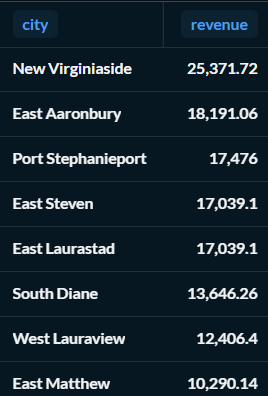
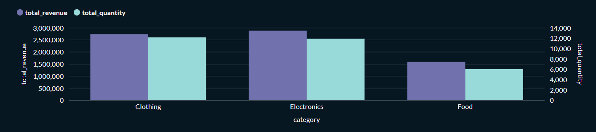
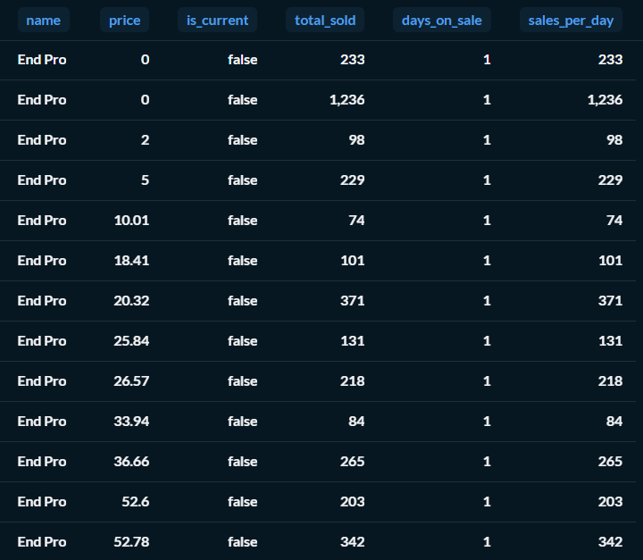

# Sentinel-Store: Resilient Data Warehouse & Analytics Platform

[](https://github.com/your-username/your-repo)
[](https://flake8.pycqa.org/)
[](https://airflow.apache.org/)

## Project Overview
Sentinel-Store is a production-grade, containerized Data Warehouse designed for a retail ecosystem. This platform moves beyond simple ETL by implementing **automated data quality gates**, **Slowly Changing Dimensions (SCD Type 2)** for historical tracking, and a **Dead Letter Queue (DLQ)** pattern for handling corrupted source data.

### **Key Engineering Highlights:**
* **Resiliency:** Automated "failure paths" for malformed data using Great Expectations and Pandas.
* **History Tracking:** SCD Type 2 implementation for Customers and Products.
* **Observability:** Real-time Telegram alerting and daily health reports.
* **DevOps:** CI/CD integration with automated unit testing and container health checks.

---

## System Architecture
The entire stack is orchestrated via **Apache Airflow** and managed through **Docker Compose**.

<p align="center">
  
</p>

### **Data Flow & Logic:**
1.  **Generation:** A Python/Faker container generates relational CSVs with intentional schema and data type errors.
2.  **Validation Gate:** **Great Expectations** validates data contracts (price > 0, valid dates).
3.  **Failure Handling:** * Validated records proceed to staging.
    * Invalid rows are logged to a `failed_sales` SQL table.
    * Corrupted files are moved to `/data/failed` and trigger a **Telegram Alert**.
4.  **Warehouse Modeling:** Cleaned data is modeled into a **Star Schema** with SCD2 logic handled via Airflow tasks.
5.  **Analytics:** Automated SQL views generate ABC analysis and retention metrics.

---

## Analytical Insights & Visualization
The final data is surfaced in **Metabase**, providing real-time visibility into the store's performance and data history.

| Customer Retention | Revenue by City | ABC Analysis |
| :---: | :---: | :---: |
|  |  |  |

| Product Category Info | Price Elasticity (SCD2) |
| :---: | :---: |
|  |  |

---

## Tech Stack
* **Orchestration:** Apache Airflow
* **Storage:** MySQL (Star Schema, SCD2)
* **Transformation:** Python (Pandas), SQL
* **Data Quality:** Great Expectations
* **Infrastructure:** Docker, Docker-Compose
* **CI/CD:** GitHub Actions (Pytest, Flake8, Service Containers)
* **Visualization:** Metabase
* **Monitoring:** Telegram Bot API

---

## Engineering Excellence
### **Automated Testing**
* **Unit Tests:** Validates extraction, cleaning, and loading logic using `unittest.mock`.
* **CI Pipeline:** On every push, GitHub Actions:
  * Performs linting via `flake8`.
  * Builds the Docker environment.
  * Runs the Great Expectations suite against a live MySQL service container.

### **Local Setup**
```bash
# Clone the repository
git clone https://github.com/dartjomd/dwh.git

# Launch the platform
docker-compose up -d